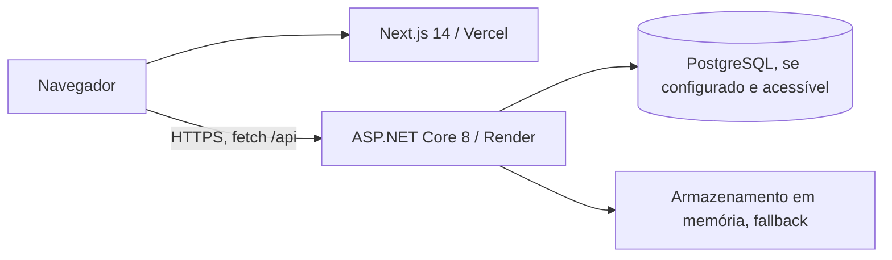

# Arquitetura

## Visão Geral

O frontend usa App Router, React Query para consultas, Zustand para estado local e `fetch` com `credentials: include`. As chamadas de API são feitas no navegador. A URL vem de `NEXT_PUBLIC_API_URL`; na ausência dela, é usado `http://localhost:5000/api`.

O backend separa `Domain` (entidades/enums), `Application` (comandos, consultas, DTOs e validação), `Infrastructure` (EF Core, repositórios e serviços) e `API` (controllers, middleware, autenticação). MediatR liga controllers aos handlers. Esta é uma aplicação com camadas, **não um conjunto de microserviços**.

## Persistência

- Com `ConnectionStrings__DefaultConnection`, o contexto EF Core usa PostgreSQL.
- O repositório consulta a conexão com `Database.CanConnect()` e recorre a um dicionário estático em memória se não conseguir conectar. Esse fallback não persiste reinícios nem sincroniza múltiplas instâncias; não deve ser interpretado como alta disponibilidade.
- O modelo define `User`, `Client` e `Opportunity`. `ValueInCents` é `long`; a interface formata como moeda brasileira.
- O repositório não contém migrações EF Core versionadas. Não assumir que o esquema de um banco novo seja criado automaticamente.

## Fluxos Principais

1. Login: o frontend envia e-mail/senha a `POST /api/auth/login`; a API valida o usuário ou aceita a credencial de demonstração codificada e emite JWT.
2. Consultas: endpoints de clientes, oportunidades e dashboard exigem autenticação. A API aceita token por cookie ou `Authorization: Bearer`.
3. Demonstração: a API retorna clientes sintéticos quando não existem clientes e registros sintéticos de dashboard/pipeline quando não existem oportunidades; o frontend também tem fallbacks de exibição. Esses valores não são métricas de produção.
4. IA: os endpoints de sugestão de e-mail e resumo retornam conteúdo baseado em templates, não em uma chamada real a modelo. A chave `OpenAI__ApiKey` é lida mas não usada para inferência.

## Limites de Responsabilidade

O backend controla autorização de endpoints. O frontend atualmente não bloqueia efetivamente o layout do dashboard quando `/auth/me` falha; isso está descrito em [Segurança](../security/README.md). CORS limita origens de navegador, mas não substitui autenticação nem autorização.
